## Olá! Eu sou o Vitor Santos 👋

  

---

### 👨‍💻 Sobre mim

  

  

---

### 🏢 Organizações

  
  

---

### 📊 GitHub Stats

  
  

  

  

---

### 🚀 Projetos em Destaque

<table align="center">
  <tr>
    <td align="center" width="300">
      
       
      
      
      
    </td>
    <td align="center" width="300">
      
       
      
      
      
    </td>
    <td align="center" width="300">
      
       
      
      
      
    </td>
  </tr>
  <tr>
    <td align="center" width="300">
      
       
      
      
      
    </td>
    <td align="center" width="300">
      
       
      
      
      
    </td>
    <td align="center" width="300">
      
       
      
      
      
    </td>
  </tr>
</table>

---

### 🧰 Tech Stack

  

---

### 📫 Onde me encontrar

  
  
  
  

---

  

  

